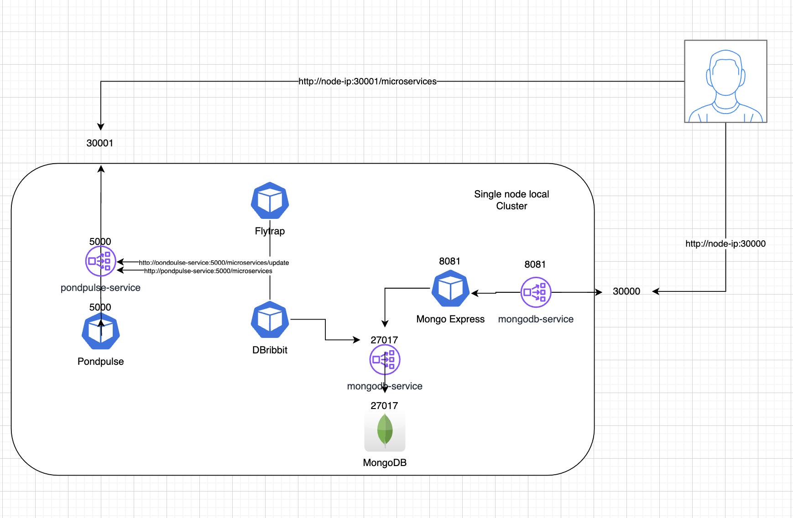

# Microservices Monitoring Solution

## Overview

This project is a microservices monitoring solution designed to ensure the smooth operation, uptime, security, and performance of a set of microservices within a SaaS platform. It consists of several components, each serving a specific purpose:

- **PondPulse**: A stateless application that generates increnemted application version and exposes metadata for the microservices. the scheme looks like this
  ```bash
  {
  "Frog1": {
    "state": "slow",
    "version": 20 ## will change on each get request
  }
  ```
- **FlyTrap**: A service that detects performance and security issues in the microservices and communicates with PondPulse to modify their state to ['insecure', 'slow', 'healthy'].

- **DBRibbit**: A component that periodically polls PondPulse and persists faulty versions to a MongoDB database.

## Architecture


## Table of Contents

- [Getting Started](#getting-started)
  - [Prerequisites](#prerequisites)
  - [Installation](#installation)
  - [Monitoring and Management](#monitoring-and-management)
  - [Deployment strategy](deployment-strategy)
- [Contributing](#contributing)

## Getting Started

### Prerequisites

Before you begin, ensure you have met the following requirements:

- A Kubernetes cluster set up (for deploying with Helm)
- Helm installed (for deploying with Helm)

### Installation

1. **Clone the repository**:

   ```bash
   git clone https://github.com/your-username/microservices-monitoring.git
   cd microservices-monitoring

2. **Running the Microservices**

   ```bash
   helm install frog-chart ./deploy

### Monitoring and Management
- PondPulse: Access PondPulse's CRUD REST APIs to retrieve information about the microservices. For example:
```bash
curl http://node-ip:30001/microservices
```

- FlyTrap: FlyTrap automatically detects performance and security issues and communicates with PondPulse to modify the state of the microservices. You can check the logs of the pod running flytrap to see if it detected any issue with one of the microservices - the interval for checking for errors is 60 seconds.
```bash
kubectl logs -f -l app flytrap
```

- BRibbit: DBRibbit polls PondPulse periodically and persists faulty versions to a MongoDB database. You can check the logs of the pod running dbribbit to see if it updated some document in the DB.
```bash
kubectl logs -f -l app=dbribbit
```

- MongoDB & Mongo express: To insure data persistency - I chose MongoDB which is a cloud native `Nosql` `DocumentDB` `Database`, and i paired it with an instance of `Mongo Express` which is an interactive lightweight Web-Based Administrative Tool to effectively manage MongoDB Databases.

  
### Deployment Strategy
For the deployment - I decided to implement the `helm` subchart strategy which is a strategy where you can manage and deploy multiple dependent charts within single `helm chart` - where you can deploy them as a single unit.
```bash
.
├── charts
│   ├── microservices
│   │   ├── Chart.yaml
│   │   ├── templates
│   │   │   ├── dbribbit-deployment.yaml
│   │   │   ├── flytrap-deployment.yaml
│   │   │   ├── pondpulse-deployment.yaml
│   │   │   └── pondpulse-service.yaml
│   │   └── values.yaml
│   └── mongo-app
│       ├── Chart.yaml
│       ├── templates
│       │   ├── 01-mongoDB-secret.yaml
│       │   ├── 02-mongoDB-deployment.yaml
│       │   ├── 03-mongoDB-service.yaml
│       │   ├── 04-mongoDB-configmap.yaml
│       │   ├── 05-mongo-exp-deployment.yaml
│       │   └── 06-mongo-exp-service.yaml
│       └── values.yaml
├── Chart.yaml
├── template.yaml
└── values.yaml
```
### Contributing
Contributions are welcome! If you'd like to contribute to this project, please fork the repository and create a pull request.
